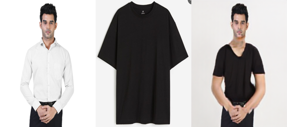
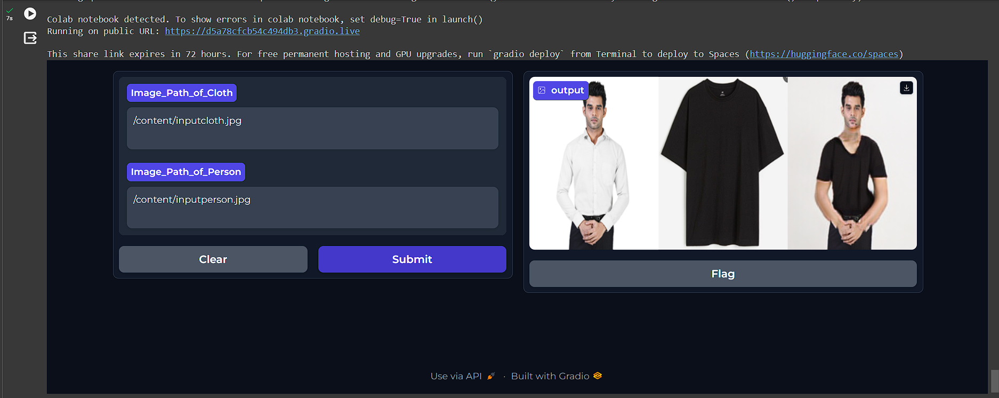

# Dress-Anything

Dress Anything is a Deep Neural Network Model based approach which aims to deliver the sense of fitting and trial of cloths on users body virtually.  
It takes normal photo of user and the dress photo from online shopping app and then neural net does its job by rightly fitting that cloth on users body giving them a taste how that particular outfit will look on them.  
Such technology could be a major break-through in Ecomm industry as user dont have to physically wear the dress and then decide whether to buy , as well as creates less confusion for online customers before byuiong right cloth.  
<h2>How to run?</h2>

Download "Dress_Anything_updated.ipynb" file OR "Gradio.ipynb". First file with only have python notebook code for project. 2nd one will have entire code with gradio WEBUI deployment code. Choose anyone and try to run.

NOTE : If you encounter Numpy error in 1st notebook , try to install numpy version 1.22.0, <b>!pip install --upgrade numpy===1.22.0</b> to resove the error

  

<h2 align="center">Here's the result.</h2>

<h2 align="center">Gradio Version (WEBUI deployment).</h2>

